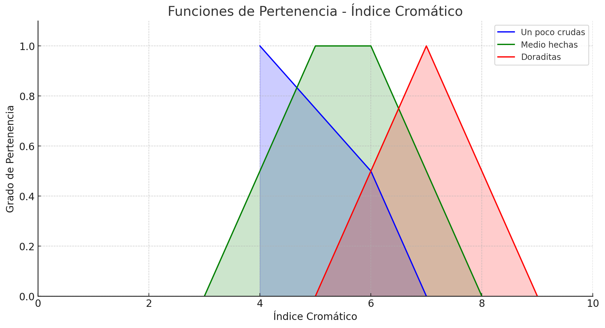
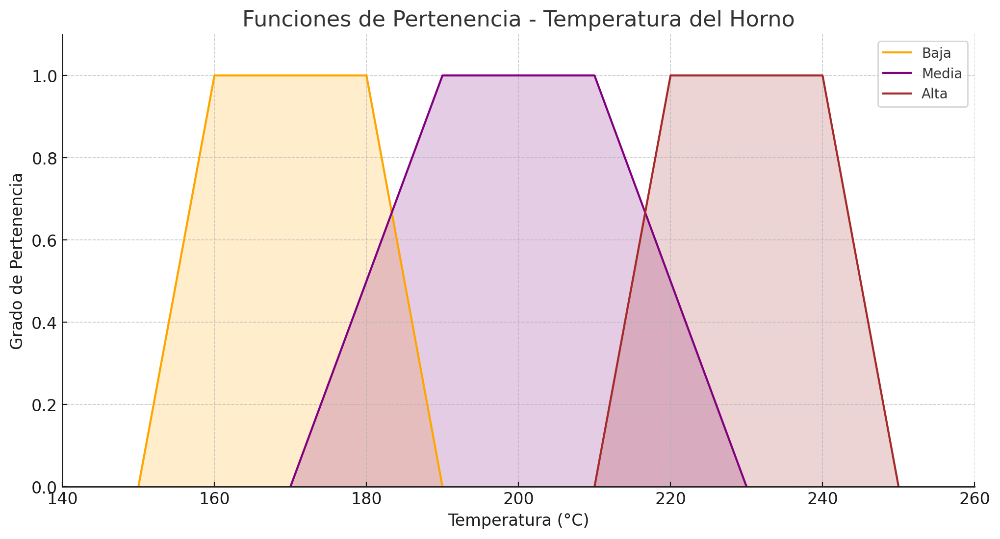
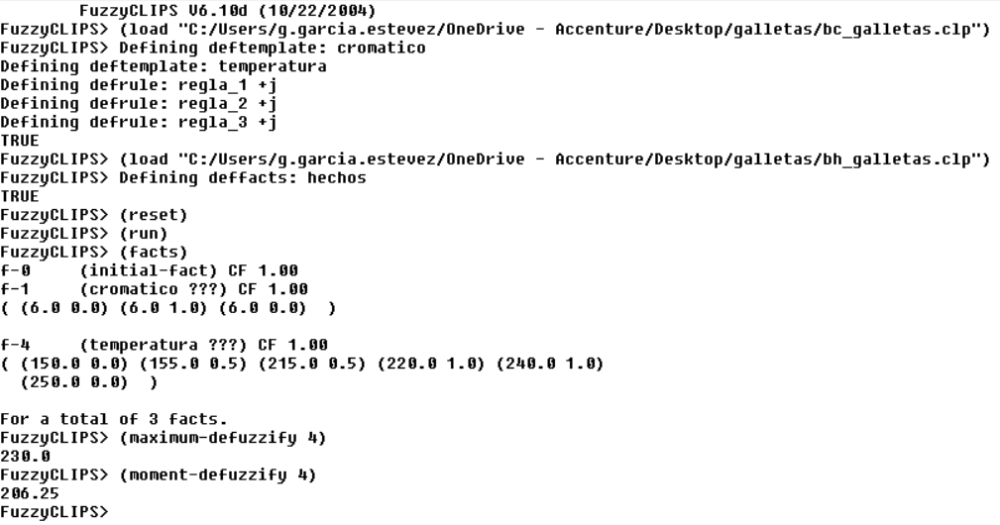

# Sistema experto para control de calidad de galletas 🍪

## Índice
- [Introducción](#introducción)
- [Estructura del Proyecto](#estructura-del-proyecto)
- [Visualizaciones](#visualizaciones)
  - [Diagrama Cromático](#diagrama-cromático)
  - [Análisis de Temperatura](#análisis-de-temperatura)
  - [Lógica Difusa](#lógica-difusa)
- [Archivos del Sistema](#archivos-del-sistema)
- [Instalación y Uso](#instalación-y-uso)
- [Contribución](#contribución)


## Introducción
Este proyecto implementa un sistema experto para el control de calidad en la producción de galletas de una abuelita, utilizando CLIPS como motor de inferencia. El sistema evalúa diferentes parámetros como el color cromático y la temperatura para determinar la calidad del producto.

## Estructura del proyecto
```
galletas/
├── bc_galletas.clp    # Base de conocimiento principal
├── bh_galletas.clp    # Base de hechos
└── images/           # Directorio de imágenes y gráficos
    ├── cromatico.png
    ├── fuzzy.png
    └── temperatura.png
```

## Visualizaciones

### Diagrama cromático

*Análisis cromático para la evaluación del color de las galletas*

### Análisis de temperatura

*Gráfico de control de temperatura durante el proceso de horneado*

### Lógica difusa

*Captura de pantalla de Fuzzy.exe con los comandos*

## Archivos del sistema
- `bc_galletas.clp`: contiene la base de conocimiento principal con las reglas y patrones para la evaluación de calidad.
- `bh_galletas.clp`: almacena la base de hechos inicial y los parámetros de configuración.

## Instalación y uso
1. Asegúrate de tener CLIPS instalado en tu sistema
2. Clona este repositorio:
```bash
git clone [URL-del-repositorio]
```
3. Carga los archivos en CLIPS:
```clips
(load "bc_galletas.clp")
(load "bh_galletas.clp")
```
4. Ejecuta el sistema:
```clips
(reset)
(run)
```

## Autores
- [Germán García Estévez](https://www.linkedin.com/in/germangarest/)
- [Pablo García Muñoz](https://www.linkedin.com/in/pablo-garc%C3%ADa-mu%C3%B1oz-a9b2402a9/)
